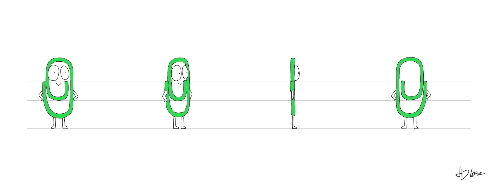



# DesktopPet

Egy WPF alapú asztali alkalmazás, amely egy „desktop petet” jelenít meg a képernyőn.
A pet interaktív, képes üzeneteket megjeleníteni, és egy beépített GPT-alapú asszisztenssel kommunikálni.

📎 A projekt vizuális koncepciója a klasszikus Microsoft Office Assistant (Clippy) jelenségéből merít inspirációt.

## Funkciók
- Átlátszó, mindig legfelül lévő WPF ablak
- Asztali karakter (pet) megjelenítése
- Felhő / chat ablak szöveges üzenetekkel
- Másolható chat tartalom
- GPT-alapú válaszadás (magyar nyelven)
- Kontextusmenü (kilépés)



# DesktopPet

Egy WPF alapú asztali alkalmazás, amely egy „desktop petet” jelenít meg a képernyőn.
A pet interaktív, képes üzeneteket megjeleníteni, és egy beépített GPT-alapú asszisztenssel kommunikálni.

📎 A projekt vizuális koncepciója a klasszikus Microsoft Office Assistant (Clippy) jelenségéből merít inspirációt.

## Funkciók
- Átlátszó, mindig legfelül lévő WPF ablak
- Asztali karakter (pet) megjelenítése
- Felhő / chat ablak szöveges üzenetekkel
- Másolható chat tartalom
- GPT-alapú válaszadás (magyar nyelven)
- Kontextusmenü (kilépés)

## Technológiák
- C#
- WPF (.NET)
- XAML
- Cloudflare Workers (proxy)
- OpenAI / GPT API

## Projekt struktúra
- `PetWindow.xaml` – fő ablak (UI)
- `PetWindow.xaml.cs` – ablak logika
- `App.xaml` – alkalmazás belépési pont
- `App.xaml.cs` – alkalmazás inicializálás

## Indítás
1. A projekt letöltése a GitHub repositoryból (ZIP vagy klónozás).
2. Projekt megnyitása Visual Studio-ban
3. `DesktopPet` indítása
4. Az alkalmazás automatikusan a `PetWindow` ablakkal indul

## Megjegyzések
- Az alkalmazás magyar nyelvű válaszokra van konfigurálva system prompt segítségével.
- A `TextBox` vezérlő read-only módban van használva a chathez, hogy a szöveg kijelölhető és másolható legyen.

## Projekt struktúra
- `PetWindow.xaml` – fő ablak (UI)
- `PetWindow.xaml.cs` – ablak logika
- `App.xaml` – alkalmazás belépési pont
- `App.xaml.cs` – alkalmazás inicializálás

## Indítás
1. A projekt letöltése a GitHub repositoryból (ZIP vagy klónozás).
2. Projekt megnyitása Visual Studio-ban
3. `DesktopPet` indítása
4. Az alkalmazás automatikusan a `PetWindow` ablakkal indul

## Megjegyzések
- Az alkalmazás magyar nyelvű válaszokra van konfigurálva system prompt segítségével.
- A `TextBox` vezérlő read-only módban van használva a chathez, hogy a szöveg kijelölhető és másolható legyen.

